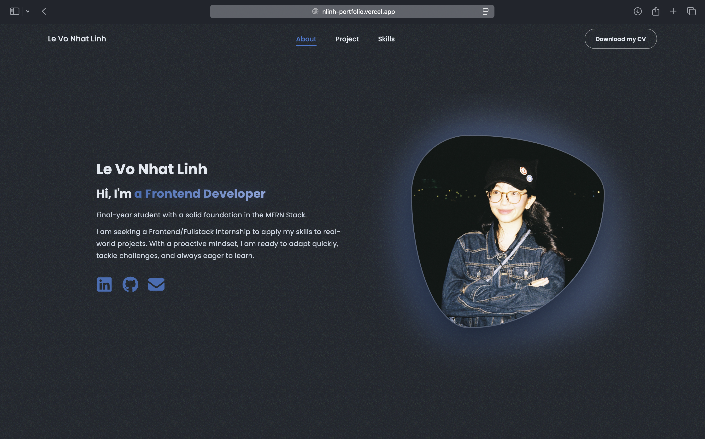

# 👩🏻‍💻 Personal Portfolio

Welcome to my personal portfolio! This repository showcases my journey, technical skills, and the featured projects I have built as a Frontend Developer.



**🚀 Explore the Live Demo:** https://nlinh-portfolio.vercel.app


### ✨ Key Features

- **Responsive Design:** Fully compatible interface across all devices (Desktop, Tablet, Mobile).
- **Modern UI:** Clean and modern design featuring Dark Mode and smooth animations.
- **Project Showcase:** Highlights of my key projects (Food Delivery, EcoTrack, etc.).
- **Download CV:** Integrated feature to download my Curriculum Vitae directly.

### 🛠 Tech Stack

This project is built using modern Frontend technologies:

- **Core:** ReactJS (Powered by Vite)
- **Styling:** CSS3
- **Icons:** FontAwesome,...
- **Deployment:** Vercel

### 📦 Installation & Local Setup

If you want to run this project locally on your machine, follow these steps:

1.  **Clone the repository:**

    ```bash
    git clone https://github.com/nlinh1509/portfolio_react.git
    ```

2.  **Navigate to the project directory:**

    ```bash
    cd portfolio_react/frontend
    ```

3.  **Install dependencies:**

    ```bash
    npm install
    ```

4.  **Start the development server:**

    ```bash
    npm run dev
    ```

5.  **Open your browser:**
    Visit `http://localhost:5173` to view the app.

### 📂 Folder Structure

```text
portfolio_react/
├── frontend/
│   ├── public/
│   ├── src/
│   │   ├── assets/       # Images, icons, and static assets
│   │   ├── components/   # React components (Navbar, About, Projects...)
│   │   ├── App.jsx
│   │   ├── main.jsx
│   │   └── ...
│   ├── index.html
│   ├── package.json
│   └── vite.config.js
└── ...
```

<p>Thanks for visiting my portfolio! ⭐️</p>

---

<p align="center">Made with ❤️ by <strong>nlinh1509</strong></p>